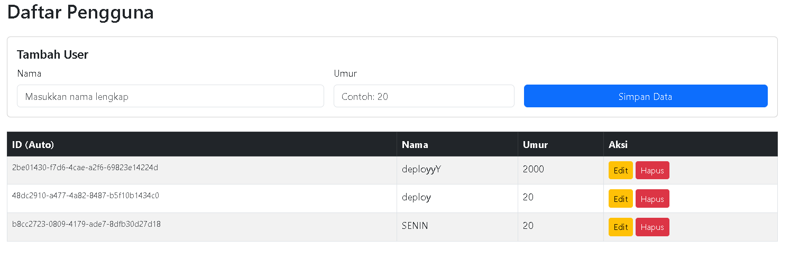
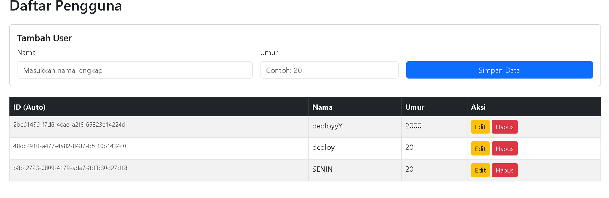
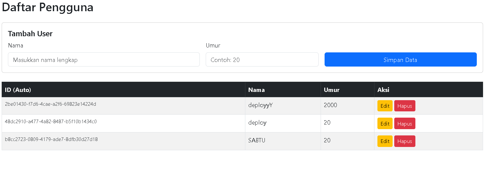
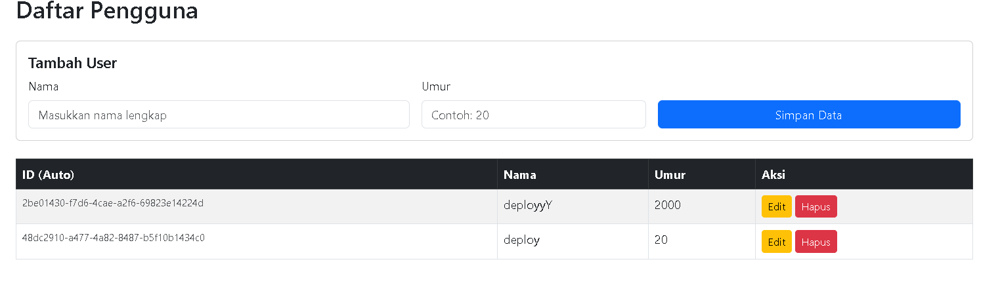

📘 Dokumentasi API — Manajemen User

Dokumentasi ini menjelaskan endpoint REST API yang digunakan untuk melakukan manajemen data user, meliputi proses Create, Read, Update, dan pengambilan data berdasarkan ID.

Base URL API:

http://localhost:8080/api

Format data yang digunakan:

Request Body → JSON

Response → JSON

Content-Type → application/json
##
 
1.Tambah User (Create User)

Digunakan untuk menambahkan data user baru ke dalam database.

Endpoint
POST /users

Full URL
http://localhost:8080/api/users

Request Body (JSON)
{
"name": "deploy",
"age": 20
}

Response 

{
"status": "success",
"data": {
"age": 20,
"id": "48dc2910-a477-4a82-8487-b5f10b1434c0",
"name": "deploy"
}
}
Keterangan

Sistem akan otomatis membuat ID (UUID) untuk user baru dan ata akan disimpan ke database.
#
2.Tampilkan Semua User (Read All Users)

Digunakan untuk mengambil seluruh data user yang tersimpan di database.

Endpoint
GET /users

Full URL
http://localhost:8080/api/users

Response (Contoh)
{

"status": "success",
"data": [
{
"age": 20,
"id": "2be01430-f7d6-4cae-a2f6-69823e14224d",
"name": "deployyY"
},

{
"age": 20,
"id": "48dc2910-a477-4a82-8487-b5f10b1434c0",
"name": "deploy"
}
]
}
Keterangan

Mengembalikan data dalam bentuk Array JSON.

Jika tidak ada data, response berupa array kosong [ ]
##
3.Cari User Berdasarkan ID (Read User by ID)

Digunakan untuk mengambil data user tertentu berdasarkan ID.

Endpoint
GET /users/{id}

Contoh URL
http://localhost:8080/api/users/550e8400-e29b-41d4-a716-446655440000

Response Berhasil

{
"status": "success",
"data": {
"age": 20,
"id": "2be01430-f7d6-4cae-a2f6-69823e14224d",
"name": "deployyY"
}
}

##
4.Perbarui Data User (Update User)

Digunakan untuk memperbarui data user yang sudah ada.

Endpoint
PUT /users/{id}

Full URL
http://localhost:8080/api/users/{id}
Request Body (JSON)
{
"name": "Nama Baru",
"age": 21
}

Response (Contoh)

{
"status": "success",
"data": {
"age": 2000,
"id": "2be01430-f7d6-4cae-a2f6-69823e14224d",
"name": "deployyY"
}
}

Keterangan

Data lama akan diperbarui sesuai input terbaru.

ID user tidak berubah.

#
CRUD WEB

1.Create Data ( Senin)

#
2.Read All Data

#
3.Update Data Senin jadi Sabtu

#
4.Delete Hapus data sabtu
